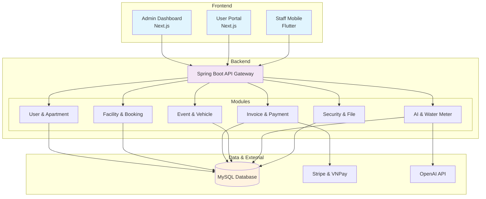
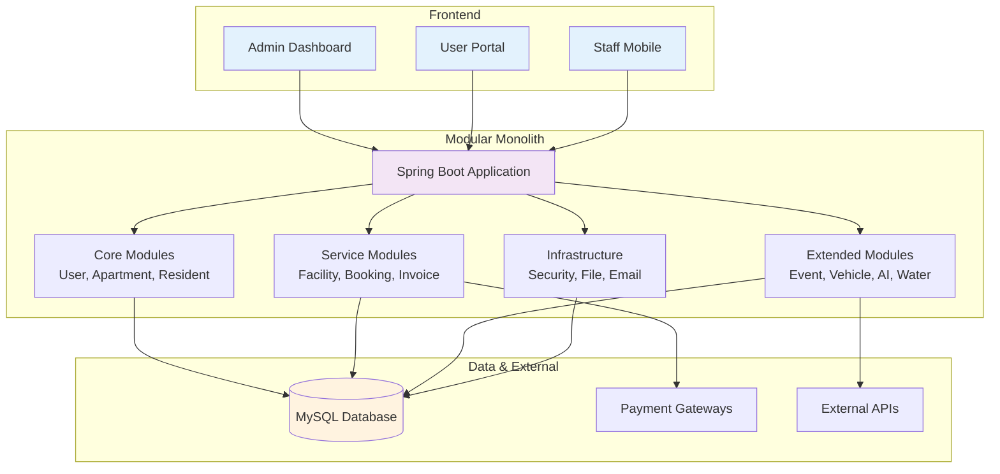

# Modular Monolith Architecture Diagram

## 1.3 Modular Monolith Architecture



## 1.4 Modular Monolith Architecture Diagram



## 1.5 Modular Monolith Details

### 1.5.1 Core Modules (Modules Cốt Lõi)

Hệ thống được xây dựng trên kiến trúc Modular Monolith với các module cốt lõi quản lý các thực thể chính:

```mermaid
graph TB
    subgraph "Core Modules"
        A[User Management Module]
        B[Apartment Management Module]
        C[Resident Management Module]
        D[Building Management Module]
    end
    
    subgraph "User Management Features"
        A1[Authentication & Authorization<br/>JWT + RBAC]
        A2[User Profile Management]
        A3[Role-based Access Control]
        A4[Email Verification System]
        A5[Refresh Token Rotation]
        A6[Password Encryption & Security]
    end
    
    subgraph "Apartment Management Features"
        B1[Building Information Management]
        B2[Apartment Unit Details]
        B3[Floor and Block Organization]
        B4[Apartment Linking System]
        B5[Unit Status Tracking]
    end
    
    subgraph "Resident Management Features"
        C1[Resident Profile Management]
        C2[Contact Information]
        C3[Apartment Assignment]
        C4[Resident Verification]
        C5[Family Member Management]
    end
    
    subgraph "Building Management Features"
        D1[Building Configuration]
        D2[Floor Management]
        D3[Block Organization]
        D4[Building Services]
    end
    
    A --> A1
    A --> A2
    A --> A3
    A --> A4
    A --> A5
    A --> A6
    
    B --> B1
    B --> B2
    B --> B3
    B --> B4
    B --> B5
    
    C --> C1
    C --> C2
    C --> C3
    C --> C4
    C --> C5
    
    D --> D1
    D --> D2
    D --> D3
    D --> D4
    
    style A fill:#e3f2fd
    style B fill:#e3f2fd
    style C fill:#e3f2fd
    style D fill:#e3f2fd
```



**Chi tiết Core Modules:**

- **User Management Module**: Quản lý xác thực, phân quyền, và hồ sơ người dùng với hệ thống JWT + RBAC
- **Apartment Management Module**: Quản lý thông tin căn hộ, tầng, khối và hệ thống liên kết
- **Resident Management Module**: Quản lý hồ sơ cư dân, thông tin liên lạc và gán căn hộ
- **Building Management Module**: Quản lý cấu hình tòa nhà và các dịch vụ

### 1.5.2 Business Service Modules (Modules Dịch Vụ Nghiệp Vụ)

Các module dịch vụ nghiệp vụ chính xử lý các chức năng core của hệ thống:

```mermaid
graph TB
    subgraph "Service Modules"
        A[Facility Management Module]
        B[Booking Management Module]
        C[Invoice Management Module]
        D[Payment Processing Module]
    end
    
    subgraph "Facility Management Features"
        A1[Facility Catalog Management]
        A2[Booking and Reservation System]
        A3[Availability Checking]
        A4[Facility Check-in System]
        A5[QR Code Integration]
        A6[Facility Status Monitoring]
    end
    
    subgraph "Booking Management Features"
        B1[Reservation Scheduling]
        B2[Booking Status Tracking]
        B3[Conflict Resolution]
        B4[Booking History]
        B5[Recurring Booking Support]
        B6[Booking Notifications]
    end
    
    subgraph "Invoice Management Features"
        C1[Monthly Invoice Generation]
        C2[Service Fee Calculation]
        C3[Payment Processing Integration]
        C4[Billing History Tracking]
        C5[Water Bill Integration]
        C6[Service Fee Configuration]
    end
    
    subgraph "Payment Processing Features"
        D1[Stripe Integration (International)]
        D2[VNPay Integration (Domestic)]
        D3[Payment Transaction Logging]
        D4[Refund Processing]
        D5[Payment Status Tracking]
        D6[Multi-currency Support]
    end
    
    A --> A1
    A --> A2
    A --> A3
    A --> A4
    A --> A5
    A --> A6
    
    B --> B1
    B --> B2
    B --> B3
    B --> B4
    B --> B5
    B --> B6
    
    C --> C1
    C --> C2
    C --> C3
    C --> C4
    C --> C5
    C --> C6
    
    D --> D1
    D --> D2
    D --> D3
    D --> D4
    D --> D5
    D --> D6
    
    style A fill:#e8f5e8
    style B fill:#e8f5e8
    style C fill:#e8f5e8
    style D fill:#e8f5e8
```

**Chi tiết Service Modules:**

- **Facility Management Module**: Quản lý danh mục cơ sở vật chất, đặt chỗ và hệ thống check-in với QR code
- **Booking Management Module**: Xử lý lịch đặt chỗ, theo dõi trạng thái và giải quyết xung đột
- **Invoice Management Module**: Tạo hóa đơn định kỳ, tính phí dịch vụ và tích hợp hóa đơn nước
- **Payment Processing Module**: Xử lý thanh toán qua Stripe và VNPay với đầy đủ tính năng giao dịch

### 1.5.3 Extended Modules (Modules Mở Rộng)

Các module mở rộng cung cấp các tính năng nâng cao và tích hợp với dịch vụ bên ngoài:

```mermaid
graph TB
    subgraph "Extended Modules"
        A[Event Management Module]
        B[Vehicle Management Module]
        C[Water Meter Management Module]
        D[AI Integration Module]
        E[Support & Feedback Module]
    end
    
    subgraph "Event Management Features"
        A1[Community Event Creation]
        A2[Event Registration System]
        A3[Event Notifications]
        A4[Event Calendar Management]
        A5[Event Attendance Tracking]
        A6[Event History & Analytics]
    end
    
    subgraph "Vehicle Management Features"
        B1[Vehicle Registration]
        B2[Parking Capacity Management]
        B3[Vehicle Access Control]
        B4[Capacity Limit Enforcement]
        B5[Vehicle Type Classification]
        B6[Parking Space Allocation]
    end
    
    subgraph "Water Meter Management Features"
        C1[Water Meter Reading Input]
        C2[Consumption Calculation]
        C3[Water Bill Generation]
        C4[Monthly Reporting]
        C5[Historical Consumption Analysis]
        C6[Water Usage Alerts]
    end
    
    subgraph "AI Integration Features"
        D1[OpenAI-powered Chatbot]
        D2[Automated Query Responses]
        D3[Knowledge Base Management]
        D4[Smart Suggestions]
        D5[Natural Language Processing]
        D6[AI Chat History Tracking]
    end
    
    subgraph "Support & Feedback Features"
        E1[Support Ticket Management]
        E2[Feedback Collection System]
        E3[Issue Resolution Tracking]
        E4[Feedback Categorization]
        E5[Response Time Monitoring]
        E6[Customer Satisfaction Metrics]
    end
    
    A --> A1
    A --> A2
    A --> A3
    A --> A4
    A --> A5
    A --> A6
    
    B --> B1
    B --> B2
    B --> B3
    B --> B4
    B --> B5
    B --> B6
    
    C --> C1
    C --> C2
    C --> C3
    C --> C4
    C --> C5
    C --> C6
    
    D --> D1
    D --> D2
    D --> D3
    D --> D4
    D --> D5
    D --> D6
    
    E --> E1
    E --> E2
    E --> E3
    E --> E4
    E --> E5
    E --> E6
    
    style A fill:#fff3e0
    style B fill:#fff3e0
    style C fill:#fff3e0
    style D fill:#fff3e0
    style E fill:#fff3e0
```



**Chi tiết Extended Modules:**

- **Event Management Module**: Quản lý sự kiện cộng đồng, đăng ký tham gia và theo dõi lịch sử
- **Vehicle Management Module**: Quản lý phương tiện, bãi đỗ xe và kiểm soát sức chứa
- **Water Meter Management Module**: Theo dõi chỉ số đồng hồ nước, tính toán tiêu thụ và tạo hóa đơn
- **AI Integration Module**: Tích hợp OpenAI để cung cấp chatbot thông minh và xử lý ngôn ngữ tự nhiên
- **Support & Feedback Module**: Quản lý yêu cầu hỗ trợ, thu thập phản hồi và theo dõi chất lượng dịch vụ

### 1.5.4 Infrastructure Modules (Modules Hạ Tầng)

Các module hạ tầng cung cấp các dịch vụ cơ sở và tiện ích hỗ trợ cho toàn bộ hệ thống:

```mermaid
graph TB
    subgraph "Infrastructure Modules"
        A[Security Module]
        B[File Upload Module]
        C[Email Service Module]
        D[WebSocket Module]
        E[Internationalization Module]
        F[Logging & Monitoring Module]
    end
    
    subgraph "Security Features"
        A1[JWT Token Management]
        A2[Refresh Token Rotation]
        A3[Password Encryption (BCrypt)]
        A4[Security Logging]
        A5[SQL Injection Prevention]
        A6[XSS Protection]
        A7[Role-based Access Control (RBAC)]
    end
    
    subgraph "File Upload Features"
        B1[Image Processing & Optimization]
        B2[Document Storage Management]
        B3[File Validation & Security]
        B4[Cloud Storage Integration Ready]
        B5[Avatar & Profile Image Handling]
        B6[Service Request Image Attachments]
    end
    
    subgraph "Email Service Features"
        C1[SMTP Configuration]
        C2[Email Templates (HTML/Text)]
        C3[Notification Sending]
        C4[Email Verification System]
        C5[Password Reset Emails]
        C6[Event & Announcement Notifications]
    end
    
    subgraph "WebSocket Features"
        D1[Real-time Communication (STOMP)]
        D2[Live Notifications]
        D3[Chat Functionality]
        D4[Status Updates]
        D5[Support Ticket Updates]
        D6[System Announcements]
    end
    
    subgraph "Internationalization Features"
        E1[Multi-language Support (vi/en)]
        E2[Localized Date & Currency]
        E3[Right-to-Left (RTL) Ready]
        E4[Dynamic Language Switching]
        E5[Localized Error Messages]
        E6[Regional Format Support]
    end
    
    subgraph "Logging & Monitoring Features"
        F1[Application Activity Logging]
        F2[Security Event Tracking]
        F3[Performance Monitoring]
        F4[Error Tracking & Reporting]
        F5[User Action Auditing]
        F6[System Health Monitoring]
    end
    
    A --> A1
    A --> A2
    A --> A3
    A --> A4
    A --> A5
    A --> A6
    A --> A7
    
    B --> B1
    B --> B2
    B --> B3
    B --> B4
    B --> B5
    B --> B6
    
    C --> C1
    C --> C2
    C --> C3
    C --> C4
    C --> C5
    C --> C6
    
    D --> D1
    D --> D2
    D --> D3
    D --> D4
    D --> D5
    D --> D6
    
    E --> E1
    E --> E2
    E --> E3
    E --> E4
    E --> E5
    E --> E6
    
    F --> F1
    F --> F2
    F --> F3
    F --> F4
    F --> F5
    F --> F6
    
    style A fill:#f3e5f5
    style B fill:#f3e5f5
    style C fill:#f3e5f5
    style D fill:#f3e5f5
    style E fill:#f3e5f5
    style F fill:#f3e5f5
```

**Chi tiết Infrastructure Modules:**

- **Security Module**: Bảo mật toàn diện với JWT, RBAC, mã hóa mật khẩu và bảo vệ chống SQL injection/XSS
- **File Upload Module**: Xử lý file ảnh, tài liệu với tối ưu hóa và bảo mật
- **Email Service Module**: Gửi email thông báo, xác thực và template HTML
- **WebSocket Module**: Giao tiếp real-time với STOMP protocol cho chat và thông báo
- **Internationalization Module**: Hỗ trợ đa ngôn ngữ (Tiếng Việt/Tiếng Anh) với định dạng địa phương
- **Logging & Monitoring Module**: Ghi log hoạt động, giám sát bảo mật và theo dõi hiệu suất

### 1.5.5 Data Layer (Tầng Dữ Liệu)

Tầng dữ liệu quản lý việc lưu trữ và truy xuất thông tin của toàn bộ hệ thống:

```mermaid
graph TB
    subgraph "Data Layer"
        A[MySQL Database]
        B[File Storage System]
        C[Cache Layer]
    end
    
    subgraph "Database Features"
        A1[Single Database Instance (MySQL 8.x)]
        A2[25+ Entities with Relationships]
        A3[ACID Compliance & Transactions]
        A4[Backup and Recovery System]
        A5[Database Migration Support]
        A6[Connection Pooling]
        A7[Query Optimization]
    end
    
    subgraph "File Storage Features"
        B1[Local File System Storage]
        B2[Image Processing & Optimization]
        B3[Document Management]
        B4[Cloud Storage Integration Ready]
        B5[File Security & Validation]
        B6[Upload Progress Tracking]
    end
    
    subgraph "Cache Layer Features"
        C1[Session Caching]
        C2[Query Result Caching]
        C3[Static Content Caching]
        C4[User Session Management]
        C5[API Response Caching]
        C6[Cache Invalidation Strategy]
    end
    
    A --> A1
    A --> A2
    A --> A3
    A --> A4
    A --> A5
    A --> A6
    A --> A7
    
    B --> B1
    B --> B2
    B --> B3
    B --> B4
    B --> B5
    B --> B6
    
    C --> C1
    C --> C2
    C --> C3
    C --> C4
    C --> C5
    C --> C6
    
    style A fill:#fff3e0
    style B fill:#fff3e0
    style C fill:#fff3e0
```

**Chi tiết Data Layer:**

- **MySQL Database**: Cơ sở dữ liệu chính với 25+ entities, hỗ trợ ACID và backup tự động
- **File Storage System**: Lưu trữ file local với tối ưu hóa ảnh và sẵn sàng tích hợp cloud
- **Cache Layer**: Hệ thống cache đa tầng để tối ưu hiệu suất và quản lý session

### 1.5.6 External Integrations (Tích Hợp Bên Ngoài)

Các tích hợp với dịch vụ bên ngoài để mở rộng chức năng của hệ thống:

```mermaid
graph TB
    subgraph "External Integrations"
        A[Payment Gateways]
        B[AI Services]
        C[Third-party APIs]
    end
    
    subgraph "Payment Gateway Features"
        A1[Stripe Integration (International)]
        A2[VNPay Integration (Domestic)]
        A3[Secure Payment Processing]
        A4[Refund & Chargeback Handling]
        A5[Multi-currency Support]
        A6[Payment Webhooks]
        A7[Transaction Reporting]
    end
    
    subgraph "AI Service Features"
        B1[OpenAI API Integration (GPT-4)]
        B2[Chat Completion & Conversations]
        B3[Natural Language Processing]
        B4[Smart Response Generation]
        B5[Context-aware Responses]
        B6[AI Chat History Management]
        B7[Knowledge Base Integration]
    end
    
    subgraph "Third-party API Features"
        C1[SMTP Email Services]
        C2[File Storage APIs (Ready)]
        C3[Notification Services]
        C4[Analytics & Monitoring]
        C5[Cloud Backup Services]
        C6[CDN Integration (Ready)]
    end
    
    A --> A1
    A --> A2
    A --> A3
    A --> A4
    A --> A5
    A --> A6
    A --> A7
    
    B --> B1
    B --> B2
    B --> B3
    B --> B4
    B --> B5
    B --> B6
    B --> B7
    
    C --> C1
    C --> C2
    C --> C3
    C --> C4
    C --> C5
    C --> C6
    
    style A fill:#e8f5e8
    style B fill:#e8f5e8
    style C fill:#e8f5e8
```

**Chi tiết External Integrations:**

- **Payment Gateways**: Tích hợp Stripe (quốc tế) và VNPay (nội địa) với đầy đủ tính năng thanh toán
- **AI Services**: Tích hợp OpenAI GPT-4 để cung cấp chatbot thông minh và xử lý ngôn ngữ tự nhiên
- **Third-party APIs**: Sẵn sàng tích hợp với các dịch vụ email, lưu trữ file và CDN

### 1.5.7 Technology Stack Summary (Tổng Kết Công Nghệ)

**Backend Technologies:**
- Spring Boot 3.2.0 với Java 20
- MySQL 8.x Database
- JWT Authentication + RBAC
- WebSocket với STOMP Protocol
- Stripe Java SDK 25.9.0 + VNPay Integration
- OpenAI Java SDK cho AI features

**Frontend Technologies:**
- Admin Portal: Next.js 15.2.4, React 19, TypeScript 5.8.3
- User Portal: Next.js 14.0.4, React 18.2.0, TypeScript 5.8.3
- Staff Mobile: Flutter 3.5.0, Dart 3.5.0

**Additional Features:**
- Internationalization (i18n) support
- Real-time communications
- File upload & image processing
- Email notifications system
- Comprehensive logging & monitoring

## Kiến trúc Modular Monolith - Tổng Quan

### 1.5.8 Đặc điểm chính của kiến trúc:
- **Single Deployable Unit**: Một ứng dụng Spring Boot duy nhất với modular structure
- **Shared Database**: Sử dụng chung một database MySQL với 25+ entities
- **Internal Communication**: Các module giao tiếp qua method calls trong cùng process
- **Unified API Gateway**: Một REST API duy nhất phục vụ tất cả clients
- **Modular Organization**: 6 nhóm module được tổ chức theo chức năng rõ ràng

### 1.5.9 Lợi ích của kiến trúc Modular Monolith:
- **Simplified Deployment**: Dễ dàng deploy và maintain một ứng dụng duy nhất
- **Consistent Data**: Không có vấn đề data consistency giữa các services
- **Lower Complexity**: Ít phức tạp hơn microservices, dễ hiểu và phát triển
- **Better Performance**: Không có network overhead giữa các services
- **Easier Development**: Dễ debug, test và phát triển tính năng mới
- **Cost Effective**: Tiết kiệm chi phí infrastructure và maintenance

### 1.5.10 Tổ chức Module:
1. **Core Modules (4 modules)**: Quản lý entities cơ bản (User, Apartment, Resident, Building)
2. **Business Service Modules (4 modules)**: Logic nghiệp vụ chính (Facility, Booking, Invoice, Payment)
3. **Extended Modules (5 modules)**: Tính năng mở rộng (Event, Vehicle, Water Meter, AI, Support)
4. **Infrastructure Modules (6 modules)**: Hạ tầng và utilities (Security, File, Email, WebSocket, i18n, Logging)
5. **Data Layer**: MySQL Database, File Storage, Cache Layer
6. **External Integrations**: Payment Gateways, AI Services, Third-party APIs

### 1.5.11 Scalability & Future Growth:
- **Horizontal Scaling**: Có thể scale theo chiều ngang khi cần thiết
- **Module Extraction**: Các module có thể được extract thành microservices riêng biệt trong tương lai
- **Database Sharding**: Hỗ trợ database sharding khi dữ liệu tăng trưởng
- **Cloud Ready**: Sẵn sàng migrate lên cloud với containerization
