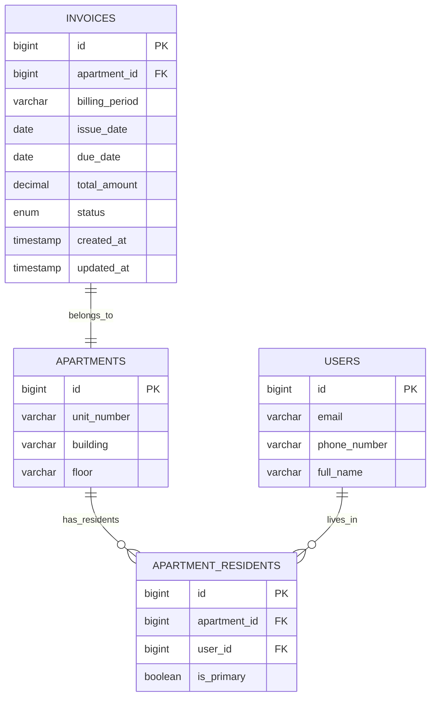

# Luồng hoạt động tính năng Hóa đơn Quá hạn

## Mermaid Diagram

```mermaid
graph TD
    A[Admin truy cập /admin-dashboard/invoices] --> B[Load danh sách hóa đơn quá hạn]
    B --> C{Has overdue invoices?}
    C -->|Yes| D[Hiển thị danh sách với checkbox]
    C -->|No| E[Hiển thị "Không có hóa đơn quá hạn"]
    
    D --> F[Admin chọn hóa đơn cần gửi nhắc nhở]
    F --> G[Admin nhấn "Gửi nhắc nhở"]
    G --> H[API: POST /api/admin/invoices/send-overdue-reminders]
    
    H --> I[Backend xử lý từng hóa đơn]
    I --> J{Invoice exists?}
    J -->|No| K[Skip - Log error]
    J -->|Yes| L{Is overdue?}
    L -->|No| M[Skip - Not overdue]
    L -->|Yes| N[Lấy email cư dân căn hộ]
    
    N --> O{Has emails?}
    O -->|No| P[Skip - No email found]
    O -->|Yes| Q[Tạo nội dung email HTML]
    Q --> R[Tạo PDF đính kèm]
    R --> S[Gửi email async]
    S --> T[Log activity]
    
    K --> U[Return result]
    M --> U
    P --> U
    T --> U
    
    U --> V[Frontend hiển thị kết quả]
    V --> W[Refresh danh sách hóa đơn]
    
    style A fill:#e1f5fe
    style H fill:#fff3e0
    style S fill:#e8f5e8
    style V fill:#f3e5f5
```

## Luồng cập nhật trạng thái quá hạn

```mermaid
graph TD
    A[Admin nhấn "Cập nhật trạng thái quá hạn"] --> B[API: POST /api/admin/invoices/update-overdue-status]
    B --> C[Query: findByDueDateBeforeAndStatus]
    C --> D[Lấy danh sách hóa đơn UNPAID có due_date < today]
    D --> E[Loop qua từng hóa đơn]
    E --> F[Set status = OVERDUE]
    F --> G[Save to database]
    G --> H[Return số lượng đã cập nhật]
    H --> I[Frontend hiển thị kết quả]
    I --> J[Refresh danh sách hóa đơn]
    
    style A fill:#e1f5fe
    style B fill:#fff3e0
    style G fill:#e8f5e8
    style I fill:#f3e5f5
```

## Cấu trúc Email Template

```mermaid
graph TD
    A[Invoice Data] --> B[Generate Email Template]
    B --> C[HTML Header with Warning Icon]
    C --> D[Alert Box: "Hóa đơn đã quá hạn"]
    D --> E[Invoice Details Table]
    E --> F[Amount in Red Color]
    F --> G[Payment Reminder Box]
    G --> H[Footer: "Ban quản lý tòa nhà"]
    H --> I[Generate PDF Attachment]
    I --> J[Send Email with Attachment]
    
    style A fill:#e1f5fe
    style C fill:#fff3e0
    style F fill:#ffebee
    style J fill:#e8f5e8
```

## Database Schema



## API Endpoints

| Method | Endpoint | Description | Request Body | Response |
|--------|----------|-------------|--------------|----------|
| GET | `/api/admin/invoices/overdue` | Lấy hóa đơn quá hạn | - | `InvoiceDto[]` |
| POST | `/api/admin/invoices/update-overdue-status` | Cập nhật trạng thái quá hạn | - | `{success, message, updatedCount}` |
| POST | `/api/admin/invoices/send-overdue-reminders` | Gửi email nhắc nhở | `Long[]` | `{success, totalProcessed, successCount, failCount, failedInvoices}` |

## Error Handling

```mermaid
graph TD
    A[API Call] --> B{Success?}
    B -->|Yes| C[Process Data]
    B -->|No| D[Check Error Type]
    
    D --> E{Network Error?}
    E -->|Yes| F[Show "Lỗi kết nối"]
    E -->|No| G{Server Error?}
    
    G -->|Yes| H[Show Server Error Message]
    G -->|No| I{Validation Error?}
    
    I -->|Yes| J[Show Validation Message]
    I -->|No| K[Show Generic Error]
    
    C --> L[Update UI]
    F --> M[Show Error UI]
    H --> M
    J --> M
    K --> M
    
    style A fill:#e1f5fe
    style C fill:#e8f5e8
    style M fill:#ffebee
```
